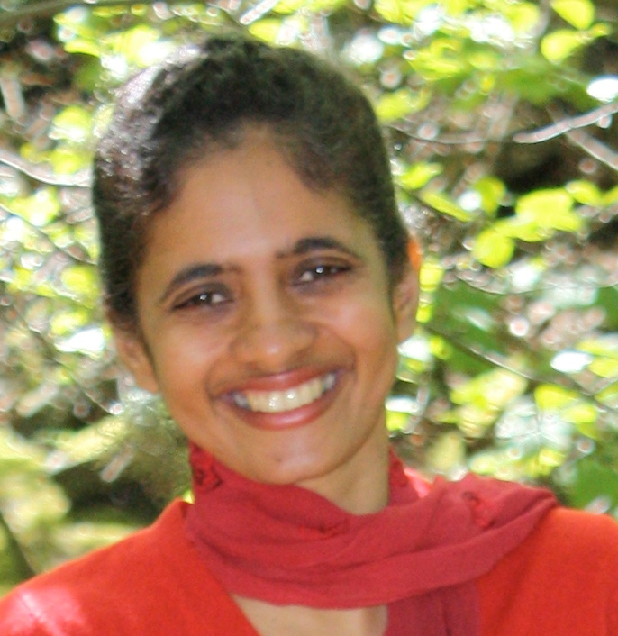

# Dr Glenna Nightingale

My PhD research focus was on spatial point process models in a Bayesian context. Since then, I have gained experience in modelling time to event data (in a Bayesian context), constructing R packages, analysing longitudinal data and spatiotemporal data, construction of complex survey weights, factor analysis and machine learning.   I possess broad skills covering both Bayesian and Frequentist statistical modelling, and have developed custom models that are perfectly suited to the task at hand rather than using off-the-shelf models.

I also collaborate with other Statisticians and Epidemiologists– for example on projects that involve Area Interaction Point Process Models,  Log Gaussian Cox Processes,  time series modelling using ARIMA, HMM, and GLMs and COVID-19 surveillance. 

***

  <a href="http://www.glennanightingale.com/"> 
    <i class="fa fa-address-card-o" style='font-size:20px; margin: 0px 5px'></i>
  </a>

